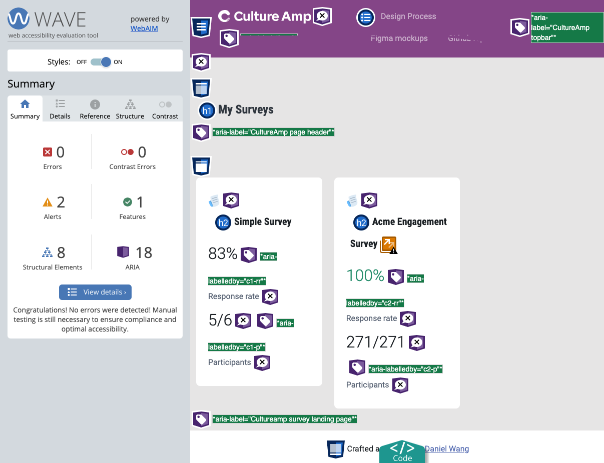

# CultureAmp design challenge




## About me
[Daniel Wang](http://danielwang.github.io/bio)

## Design Process

[Design Process on FigJam file](https://www.figma.com/file/66dmIPykFMzxAOpJxtw9zm/Design-Process?node-id=0%3A1)

[Hi fidality mockups on Figma file](https://www.figma.com/file/xK3FBWEkRmFfYZtshZugTi/CultureAmp-Design-Challenge-Daniel-Wang?node-id=15%3A1014)


## Download and Installation app

Install the dependencies:

```powershell-interactive
npm install
```

## View the app

Run locally:

```powershell-interactive
npm start
```
It will automatically fire up brower tab http://localhost:3000/ 

## Framework and Template
- [react-bootstrap-starter](https://github.com/ChrisAchinga/react-bootstrap-starter)
- [Bootstap 5 sass](https://getbootstrap.com/)

## Dependencies:

- [React](https://reactjs.org/)
- [Create React App](https://create-react-app.dev/)
- [react-bootstrap](https://react-bootstrap.github.io/)

